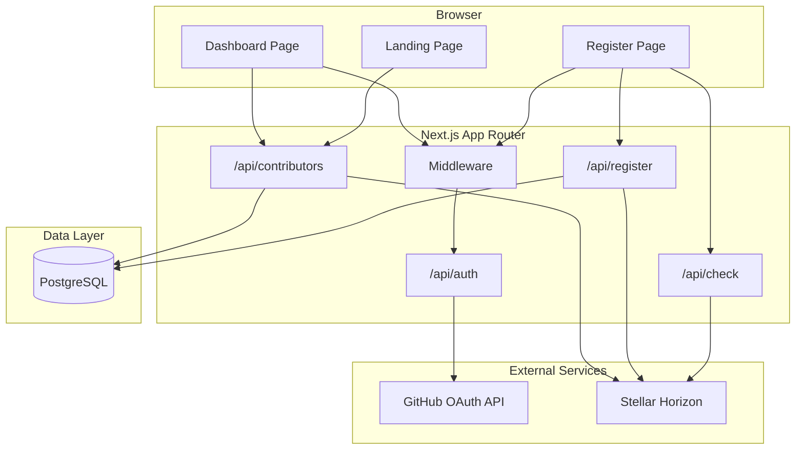
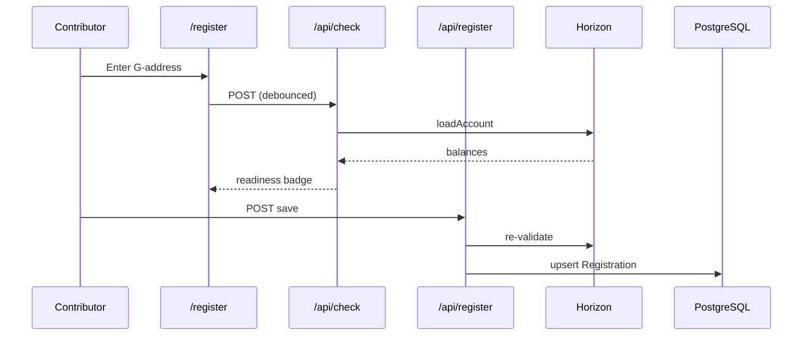

# Architecture

This document describes how **TrustBridge Dashboard** is designed. For setup instructions see [SETUP.md](./SETUP.md). For directory layout see [PROJECT_STRUCTURE.md](./PROJECT_STRUCTURE.md).

← Back to [README](../README.md)

---

## Overview

TrustBridge Dashboard is a **Next.js 14 App Router** application that solves contributor payout coordination on Stellar:

```
GitHub Identity  ──►  Registration DB  ──►  Horizon Validation  ──►  Wave CSV Export
     (OAuth)            (Prisma/PG)         (stellar-sdk)            (Maintainers)
```

### Core responsibilities

1. **Identity binding** — Map `github_username` → `stellar_address` after GitHub OAuth
2. **Readiness validation** — Query Horizon for funding, USDC trustline, XLM balance
3. **Maintainer operations** — Aggregate view, filters, batch re-check, CSV export

---

## System diagram



---

## Authentication & authorization

### GitHub OAuth (NextAuth.js)

- Provider: GitHub with scopes `read:user`, `user:email`, `read:org`
- Session strategy: **JWT** (no server-side session table required at runtime)
- On sign-in, user record is upserted in PostgreSQL with `githubId`, `githubUsername`, and `accessToken`
- The GitHub access token is **encrypted at rest** (AES-256-GCM, `TOKEN_ENCRYPTION_KEY`) before being written — see [`src/lib/token-crypto.ts`](../src/lib/token-crypto.ts) — and every encrypt/decrypt attempt is recorded in `TokenAuditLog` via [`src/lib/token-audit.ts`](../src/lib/token-audit.ts)
- The raw access token is **never** placed on the JWT or session object, so it is never sent to the browser; server code that needs it calls `getDecryptedGithubAccessToken(userId)` in `src/lib/auth.ts`

### Route protection (`src/middleware.ts`)

| Route | Requirement |
|-------|-------------|
| `/register` | Authenticated GitHub user |
| `/dashboard` | Authenticated + member of `GITHUB_MAINTAINER_ORG` |

Maintainer check flow:

1. After GitHub OAuth, JWT callback calls `GET https://api.github.com/user/orgs`
2. Compares org logins against `GITHUB_MAINTAINER_ORG`
3. Sets `session.user.isMaintainer` boolean

Non-maintainers hitting `/dashboard` are redirected to `/register?error=maintainer`.

---

## Data model

See `prisma/schema.prisma`.

```
User
├── githubId (unique)
├── githubUsername (unique)
├── accessToken (encrypted at rest — AES-256-GCM ciphertext, never plaintext)
├── registration → Registration (1:1)
└── auditLogs → TokenAuditLog (1:many)

Registration
├── stellarAddress (unique)
├── funded, trustlineReady, xlmBalance
└── lastCheckedAt

TokenAuditLog
├── userId
├── action (token_encrypted_at_signin | token_encryption_skipped | token_decrypted | token_decrypt_failed)
├── success
└── createdAt
```

NextAuth adapter models (`Account`, `Session`, `VerificationToken`) are included for future database-session support but JWT is used by default.

---

## Horizon validation pipeline

Implemented in `src/lib/horizon.ts` using **stellar-sdk** `Horizon.Server`.

### `/api/check` flow

1. Validate G-address format via `StrKey.isValidEd25519PublicKey`
2. `server.loadAccount(address)` — 404 means unfunded
3. Parse native XLM balance from `account.balances`
4. Check for matching asset trustline (`asset_code` + `asset_issuer`)
5. Compute readiness via `computeReadiness()` in `src/lib/stellar.ts`

### Readiness rules

| Condition | Status |
|-----------|--------|
| Not funded OR no trustline | `not_ready` |
| Funded + trustline, XLM < `NEXT_PUBLIC_MIN_XLM_BALANCE` | `low_reserve` |
| Funded + trustline + sufficient XLM | `ready` |

Default asset: **USDC** on Stellar mainnet (configurable via env).

---

## Registration flow



Registration enforces:

- Authenticated session
- Valid Stellar address format
- Unique `stellarAddress` across users (409 if taken)

---

## Maintainer dashboard flow

1. `GET /api/contributors` — list all registrations with computed readiness
2. **Re-check all** — `POST /api/contributors` batch-queries Horizon, updates DB
3. **Export CSV** — client-side download via `exportContributorsCsv()`

CSV columns: `github_username`, `stellar_address`, `readiness`, `funded`, `trustline`, `xlm_balance`, `last_checked_at`

---

## Frontend architecture

| Concern | Approach |
|---------|----------|
| Server components | Landing page (stats), layout metadata |
| Client components | Register, dashboard, interactive inputs |
| Server state | React Query (`Providers.tsx`) |
| Theming | `next-themes` + CSS variables (light/dark) |
| UI primitives | shadcn/ui-style components in `src/components/ui/` |

Key components:

- `AddressInput` — debounced live `/api/check` validation
- `TrustlineStatusBadge` — readiness indicator
- `ContributorTable` — sort, filter, CSV export
- `WaveReadinessBar` — aggregate progress bar

---

## Security considerations

- **Secrets server-side only** — `GITHUB_CLIENT_SECRET`, `DATABASE_URL`, `NEXTAUTH_SECRET` never exposed to client
- **Horizon calls server-side** — `/api/check` prevents CORS/rate-limit issues and keeps validation logic centralized
- **Maintainer API guard** — `/api/contributors` verifies `isMaintainer` on every request
- **CSRF protection on mutating routes** — `POST /api/check`, `POST /api/register`, `POST /api/contributors` validate `Origin`/`Referer` against allowed hosts (see [docs/CSRF.md](../docs/CSRF.md))
- **Rate limiting on `/api/check`** — per-IP sliding window (default 10 req/min) prevents Horizon abuse; configurable via `RATE_LIMIT_WINDOW_MS` and `RATE_LIMIT_MAX_REQUESTS`
- **CSV / JSON exports** — `src/lib/csv.ts` provides `buildCsv` and `buildJson` with snapshot-tested output; used by the maintainer dashboard for Wave payout prep
- **Secrets server-side only** — `GITHUB_CLIENT_SECRET`, `DATABASE_URL`, `NEXTAUTH_SECRET`, `TOKEN_ENCRYPTION_KEY` never exposed to client
- **Tokens encrypted at rest** — `User.accessToken` is AES-256-GCM ciphertext; sign-in fails closed (stores nothing) if `TOKEN_ENCRYPTION_KEY` is missing or malformed rather than falling back to plaintext
- **No client-side access tokens** — the GitHub access token never appears on the NextAuth JWT or `session` object; it exists only encrypted in PostgreSQL, decrypted on demand server-side via `getDecryptedGithubAccessToken()`
- **Horizon calls server-side** — `/api/check` and `/api/actions/lookup` prevent CORS/rate-limit issues and keep validation logic centralized
- **Maintainer API guard** — `/api/contributors`, `/api/soroban/events`, and `/api/settings/network` verify `isMaintainer` on every request
- **Address uniqueness** — prevents duplicate payout mappings

---

## Action lookup readiness API

`GET /api/actions/lookup?address=G...` (`src/app/api/actions/lookup/route.ts`) wraps the same Horizon check used by `/api/check`, but as a cacheable `GET` that also computes a `nextAction` hint (`fund_account`, `add_trustline`, `increase_reserve`, `none`) via [`src/lib/action-lookup.ts`](../src/lib/action-lookup.ts). Results are cached for 30s per `address:asset_code:asset_issuer` key in `verificationCache` (`src/lib/cache.ts`) to absorb bursts against Horizon rate limits. The registration wizard (`AddressInput`) uses the same pure `computeNextAction()` helper to show contributors what to do next.

---

## Soroban event timeline

The maintainer dashboard's **Soroban event timeline** panel (`src/components/SorobanEventTimeline.tsx`) shows recent contract events for `SOROBAN_CONTRACT_ID`, fetched server-side via `getSorobanEventTimeline()` (`src/lib/soroban.ts`) using `stellar-sdk`'s Soroban RPC client (`SOROBAN_RPC_URL`, default `soroban-testnet.stellar.org`). Exposed through `GET /api/soroban/events` (maintainer-only). RPC outages, rate limits, or a missing `SOROBAN_CONTRACT_ID` never throw — they surface as an `errors` array the panel renders inline, with an empty event list.

---

## Network hardening

Horizon and Soroban RPC network selection is env-var driven (`NEXT_PUBLIC_HORIZON_URL`, `SOROBAN_RPC_URL`) with independent defaults that do not agree with each other — Horizon defaults to **mainnet**, Soroban RPC defaults to **testnet**. Left unchecked, this lets a maintainer validate contributor funding against one network while reading Soroban events from another with no indication anything is wrong.

[`src/lib/network-config.ts`](../src/lib/network-config.ts) classifies each resolved URL by hostname (`mainnet` / `testnet` / `custom`) and flags `mismatched: true` only when both URLs resolve to two different *known* named networks — a custom or self-hosted RPC endpoint on either side is never treated as a false positive, since it cannot be confidently classified.

- **API:** `GET /api/settings/network` (maintainer-only) returns the current classification and any warnings.
- **UI:** the `NetworkStatusPanel` component (`src/components/NetworkStatusPanel.tsx`) renders on `/dashboard`, showing the Horizon/Soroban network badges and a warning banner when mismatched.
- **Audit trail:** a mismatch writes a `network_config_mismatch_detected` entry to the existing `AuditLog` table via `recordAuditLog()`, visible through `GET /api/audit`.

This is intentionally read-only and additive — it surfaces the misconfiguration rather than attempting to auto-correct it, since the "right" network is a deployment decision, not something the dashboard can infer.

---

## Future: Soroban registry

This section covers the full lifecycle of Soroban integration: the read path that ships today, and the write-through path that is designed but intentionally **not yet implemented**.

### Read path (implemented today)

- `getSorobanEventTimeline()` (`src/lib/soroban.ts`) opens a `stellar-sdk` `rpc.Server` against `SOROBAN_RPC_URL` (default `soroban-testnet.stellar.org`), reads the latest ledger, and fetches recent events for `SOROBAN_CONTRACT_ID` over a fixed ~7-hour ledger window.
- Exposed via `GET /api/soroban/events` (`src/app/api/soroban/events/route.ts`), guarded by `isMaintainer` — same guard pattern as `/api/contributors`.
- **Never throws.** A missing `SOROBAN_CONTRACT_ID` short-circuits before any RPC call and returns `{ events: [], latestLedger: 0, errors: ["SOROBAN_CONTRACT_ID is not configured"] }`. An RPC failure (outage, rate limit, timeout) is caught and returns `{ events: [], latestLedger: 0, errors: ["Soroban RPC error: <message>"] }`. Either way the API responds `200` with an `errors` array the `SorobanEventTimeline` panel renders inline — the maintainer dashboard degrades gracefully instead of failing.
- No caching layer sits in front of this call today (unlike `/api/actions/lookup`, which caches Horizon reads for 30s in `src/lib/cache.ts`); each request re-queries the RPC endpoint. A cache would be a reasonable addition if this panel sees high-frequency polling.
- Unit coverage: `src/lib/soroban.test.ts` (success, missing config, RPC failure) and `src/app/api/soroban/events/route.test.ts` (maintainer guard: 403 for anonymous/non-maintainer, 200 with the timeline payload for a maintainer).

### Write-through path (design only — not implemented)

No code path writes to a Soroban contract today. `/api/register` (`src/app/api/register/route.ts`) only performs a Horizon check and a Prisma upsert. This section documents the intended design so a future contributor can implement it consistently and safely:

- **PostgreSQL stays the source of truth.** A Soroban write is a mirror, not a replacement — dashboard reads, Wave aggregation, and CSV export continue to query Postgres exclusively.
- **Ordering:** the contract write would be attempted in `/api/register`'s `POST` handler **after** `prisma.registration.upsert()` resolves successfully — never before, and never in a way that blocks or gates the Postgres write.
- **Best-effort and failure-isolated:** the write attempt must be wrapped so that a Soroban RPC outage, rate limit, or a missing `SOROBAN_CONTRACT_ID` can never fail the request or roll back the registration. The existing `getSorobanEventTimeline()` "never throw, return an `errors` array" convention is the model to follow — e.g. a `mirrorRegistrationToSoroban()` helper that returns a result/error object rather than throwing, called with its outcome logged (not surfaced as a request failure) and never `await`-blocking the HTTP response on-chain confirmation.
- **Zero on-chain dependency for the core flow:** contributors must be able to register successfully with `SOROBAN_CONTRACT_ID` unset entirely, exactly as today.
- **Where it would live:** a new `src/lib/soroban-register.ts` (or an addition to `src/lib/soroban.ts`) exporting the write helper, invoked from `/api/register`'s `POST` handler per the ordering above.

### Edge cases

| Case | Read path (today) | Write-through (design) |
|------|--------------------|--------------------------|
| RPC outage / timeout | Caught, `errors: ["Soroban RPC error: ..."]`, empty events, `200` response | Caught, logged, registration still succeeds |
| Missing/invalid `SOROBAN_CONTRACT_ID` | Short-circuits before any RPC call, `errors: ["SOROBAN_CONTRACT_ID is not configured"]` | Write attempt skipped entirely; registration unaffected |
| Rate limiting | Same as outage — surfaces in `errors`, no throw | Same as outage — best-effort, never blocks Postgres |

### Out of scope for this iteration

End-to-end/browser coverage (e.g. Playwright) for the event timeline panel and any future write-through flow is a deliberate follow-up, not a gap in this pass — this repo currently has no Playwright/e2e harness, and adding one is a separate infrastructure change (new CI browser setup) tracked independently of this documentation and unit/API test work.

---

## Related docs

- [Project structure](./PROJECT_STRUCTURE.md)
- [Environment variables](./ENVIRONMENT.md)
- [Deployment](./DEPLOYMENT.md)
- [Contributing](./CONTRIBUTING.md)
